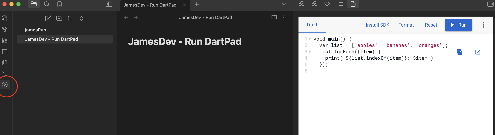
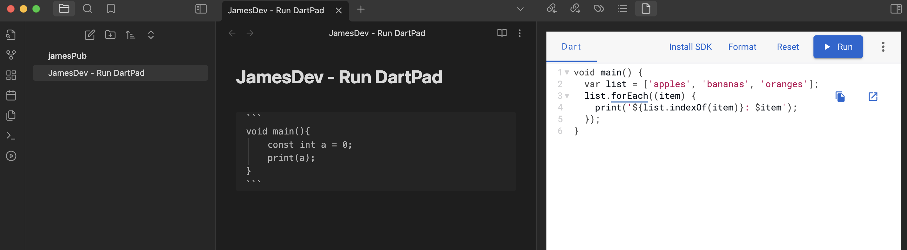
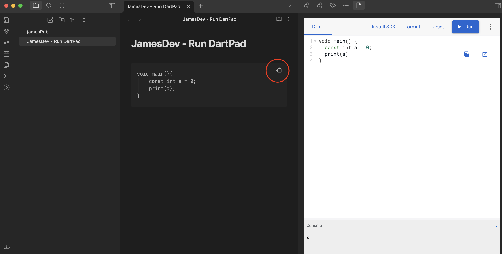

# Run DartPad 

Obsidian + DartPad

<br/>옵시디언과 다트패드를 함께 사용 할 수 있습니다.
<br/>You can use Obsidian and DART-Pad together.
<br/>
<br/>
<hr />
<br/>
### preivew

<br/>

Run DartPad 설치하면 리본 메뉴에 버튼이 생성됩니다.
<br/>
버튼을 클릭하면 우측에 DartPad 창이 나타납니다.
<br/>


\``` ~ ``` 를 코드 앞뒤로 붙이면 obsidian 에 코드를 작성 할 수 있습니다.
<br/>학습하며 작성 한 코드를 DartPad 에 붙여넣고 테스트를 진행하여 결과를 볼 수 있습니다.
<br/>
<br/>
(1)

<br/>
(2)

<br/>
<hr />
<br/>

### UPDATES
- [ ] add more Language(JS, Python ...)
- [ ] add Framework
- [ ] ...
